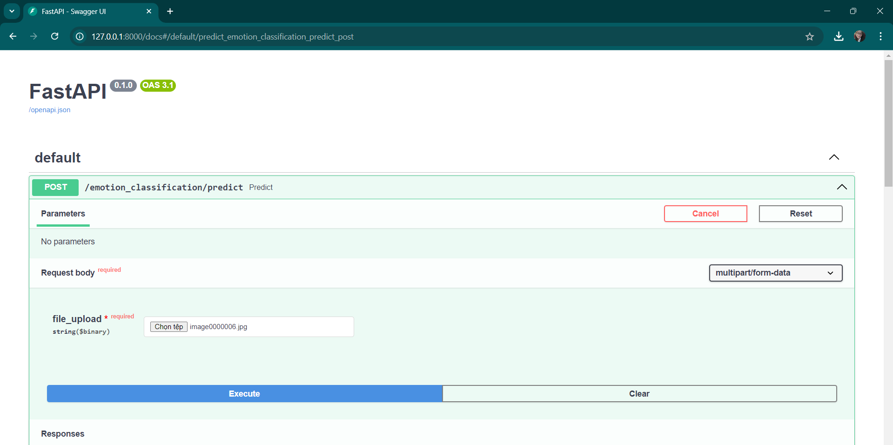
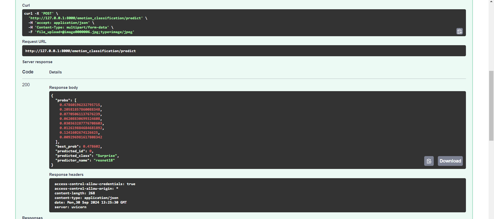

# Deploy Deep Learning Model with FastAPI
## Project Overview


The system prepares and processes the AffectNet dataset, splitting the data for training and testing on the ResNet-18 model. The model is optimized by tuning hyperparameters, and an API for real-time image emotion prediction is deployed using FastAPI. 

---

### Directory Structure
```
root/
├── config/
│   ├── Emotion_cfg.py
│   └── logging_cfg.py
├── logs/
├── middleware/
│   ├── __init__.py
│   ├── cors.py
|   └── http.py
├── models/
│   ├── weights/
│   │   └── emotion_weights.pt
│   ├── dataset.py
│   ├── Emotion_model.py
│   └── Emotion_predictor.py
├── routes/
│   ├── base.py
│   └── Emotion_route.py
├── schemas/
│   └── Emotion_schema.py
├── utils/
│   └── logger.py
├── app.py
├── requirements.txt
└── server.py

```

---

Result




